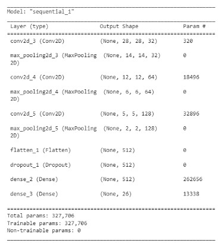
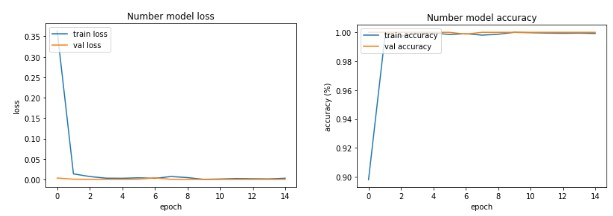
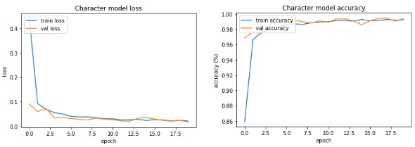

# Autonomous_Vehicle_Controller
## Project Summary
The purpose of this project is to autonomously control a robot as it travels around a track and returns license plates and parking IDs of parked cars (all within Gazebo). Points are given for each correct license plate returned and the completion of the first lap. Points are deducted for violations of traffic laws (driving off the road and collisions with vehicles and pedestrians), with the team with the most points at the end of a four-minute run being the victors. 

## Implementation
### Driving controller

### License plate detection
To detect the parked vehicle on the side of the road, we first identify the pixels that represent the letters and numbers on the license plate using SIFT and k-mean, then feed the filtered data to a pretrained convolutional neural network(CNN) for classification. We used 2 seperate networks, one used for classifying letter and the other used for numbers. 

In order to obtain training data, we decided to augment the data obtained from added letters and numbers artificially in a controlled environment and then crop the locations of interest in such a way that it resembles the license plate letters and numbers in the actual environment as much as possible. To achieve this, we first obtain images of the 26 characters and 10 numbers individually in a controlled setting, then perform various augmentation on the original image. We then generate 3000 augmented data for each letter and number to be used for training and validation

The structure to the CNN for license plate detection is shown below:

The resulting loss and accuracy of the trained models for character and number classification:

When deploying the model in the environment, we observe that it has lower accuracy than expected, and to combat this issue, we run multiple predictions over the same license plate as we drive past and use the highest occurring result, which increased the accuracy during deployment. 

For a more details on the implementation in general, please visit the written report [here](https://docs.google.com/document/d/1nBrcH8DOpMLleIeqdEdOWQSkl-nec-v0-9Zv5-VMYU4/edit?usp=sharing)

## Installation
To setup the ROS environment, follow the installation guide [here](ROS_environment/README.md)

## Contact Information
Eric Fan - [Email](mailto:ericfan1110@gmail.com)
Harry Hu - [Email](mailto: ADSKFJGLAIWEHGOLAIWEHG  )
